## Setting up the ELK Stack


<small>[90 minutes]</small>

---

### Overall architecture diagram


---

### The Virtual Machine

----

Import the provided `infra-mon-elk.ova` file into Virtual Box


----

Change the location of the disk (if you want)
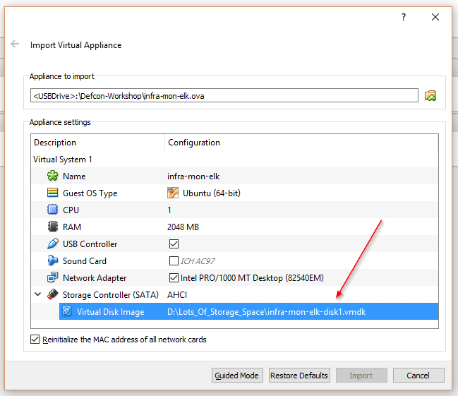

----

Boot the VM
```
user: ninja
password: ninja
```

----

Check your IP address

```
ifconfig
```

----

Check connectivity to the VM **from** your local computer

```
ping <IP_obtained_from_previous_step>
```

----

Add a host entry in your **host machine**

(use sudo/administrator)

```
192.168.56.101  elkhost.defcon
```

```
notepad %windir%\System32\drivers\etc\hosts
```

```
echo "192.168.56.101  elkhost.defcon" | sudo tee --append /etc/hosts
```

----


### Installing Java

- Elasticsearch & Logstash requires Java to run
- The virtual machine already has JAVA installed

----

### Installing Java
- The commands below will add the repository and install Java (in case you want to try this out)

```
sudo add-apt-repository -y ppa:webupd8team/java
sudo apt-get update -y
sudo apt-get -y install oracle-java8-installer
```

- Check the JAVA installation version by running the command below

```
java -version
```

---

## Setting up Elasticsearch
(let's get our hands dirty!)

----

<div align="left">**PS:** We have provided installer files in the VM `/home/ninja/pkgs` directory
<br />
<br />
**PPS:** We weren't sure of the Internet connectivity here when creating the VM
</div>

----

### Installing Elasticsearch
(hands on)

- Install Elasticsearch by running the command below:

```
sudo dpkg -i /home/ninja/pkgs/elasticsearch.deb
```

Note: since the deb file has already been downloaded. The usual route would be to add the Elasticsearch gpg key, add the Elasticsearch repo to the sources and then the standard apt-update and apt-get install.

----

- Start Elasticsearch service by running:

```
sudo service elasticsearch start
```

----

- Check whether Elasticsearch is running or not:

```
curl -XGET 'http://localhost:9200'
```


---

### Elasticsearch configuration
(hands on)

----

- Some basic configurations to start with:

```
sudo vi /etc/elasticsearch/elasticsearch.yml
```

----

Uncomment the following lines, make the changes as shown below and save the file:

----

<div align="left">Cluster name should be unique:</div>

```
cluster.name: elk-defcon
```

<div align="left">Node name is to identify the node in a cluster:</div>
```
node.name: node-1
```

<div align="left">To avoid memory swapping for Elasticsearch:</div>
```
bootstrap.mlockall: true
```

<div align="left">Access:</div>
```
network.host: 0.0.0.0
```


Note: Cluster name used to connect across nodes.<br />
Node names are mostly hostnames.<br />
To avoid swapping for elasticsearch.<br />
Protect access.<br />

----

<div align="left">Restart the Elasticsearch service:</div>

```
sudo service elasticsearch restart
```

----

<div align="left">Check the Elasticsearch cluster status</div>

```
curl -XGET 'http://localhost:9200/_cluster/health?pretty'

curl -XGET 'http://localhost:9200/_cluster/state?pretty'
```
<br />
<div style="font-size:15px" align="left">
- <font color="green">`green`</font> - All primary and replica shards are active.
- <font color="yellow">`yellow`</font> - All primary shards are active, but not all replica shards are active.
- <font color="red">`red`</font> - Not all primary shards are active.
<div>

---

### Setting up another node
(hands on)

####PS: Open another SSH session

----

<div align="left">To add another node, we extract the files from the elasticsearch tar zip:</div>

```
tar -xvf /home/ninja/pkgs/elasticsearch-2.3.4.tar.gz -C /home/ninja/pkgs/

cd /home/ninja/pkgs/elasticsearch-2.3.4
```

<div align="left">And edit the config as we did for the previous node:</div>

```
vi config/elasticsearch.yml
```

----

<div align="left">Add a node name, while keeping the cluster name constant across both the nodes:</div>
```
cluster.name: elk-defcon
node.name: node-2
bootstrap.mlockall: true
network.host: 0.0.0.0
```

----

<div align="left">Start the second node by running the following command:</div>

```
./bin/elasticsearch
```

Note: We use the same VM to install another node on the side

----

<div align="left">Recheck the Elasticsearch cluster status now:</div>

```
curl -XGET 'http://localhost:9200/_cluster/health?pretty'

curl -XGET 'http://localhost:9200/_cluster/state?pretty'
```

---


## So What happens in a multi node cluster?

----

### Clustering

> Elasticsearch is built to be always available, and to scale. Scale can come from buying bigger servers (vertical scale, or scaling up) or from buying more servers (horizontal scale, or scaling out).

Note: We need to start by understanding the word 'Clustering' in context with Elasticsearch

----

### An Empty Cluster

Our cluster with a single node, with no data and no indices:


- A node is a running instance of Elasticsearch
- A Cluster consists of one or more nodes with the same cluster.name

Note:By default Elasticsearch will have 5 primary shards and 1 replica shard with cluster name `elasticsearch` and node name as a random Marvel character.

----

### Adding index

- In an empty one-node cluster, we will assign three primary shards and one replica
- There is one replica for all the primary shards


Note: Because there is no separate node, the replica shard becomes unassigned. Which is why it is not denoted in this image.

----

### Add Failover

- Running a single node means that you have a single point of failure - there is no redundancy
- We can simply start another node to prevent data loss


----

### Scale Horizontally

- One shard each from Node 1 and Node 2 have moved to the new Node 3


Note: This means that the hardware resources (CPU, RAM, I/O) of each node are being shared among fewer shards, allowing each shard to perform better

----

### Scale more

Three primaries and six replicas. This means that we can scale out to a total of nine nodes, again with one shard per node


Note: This would allow us to triple search performance compared to our original three-node cluster

----

### Failover Test

- A cluster must have a master node in order to function correctly
- When a master node dies, the nodes elect a new master


---

### Installing Elasticsearch plugins
(hands on)
<br />
<br />
We downloaded the plugins as well: `/home/ninja/plugins/`

----

<div align="left">To check the list of installed plugins</div>

```
sudo /usr/share/elasticsearch/bin/plugin list
```

<div align="left">To install the head plugin from a local file:</div>

```
sudo /usr/share/elasticsearch/bin/plugin install file:/home/ninja/plugins/head.zip
```

<div align="left">To install the hq plugin from a local file:</div>

```
sudo /usr/share/elasticsearch/bin/plugin install file:/home/ninja/plugins/hq.zip
```

----

<div align="left">To download and install directly from the Internet repo:</div>

```
sudo /usr/share/elasticsearch/bin/plugin install mobz/elasticsearch-head
```

---

### Elasticsearch plugins overview

----

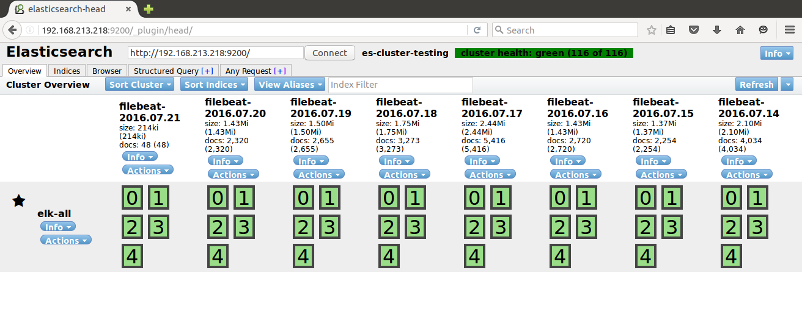

----

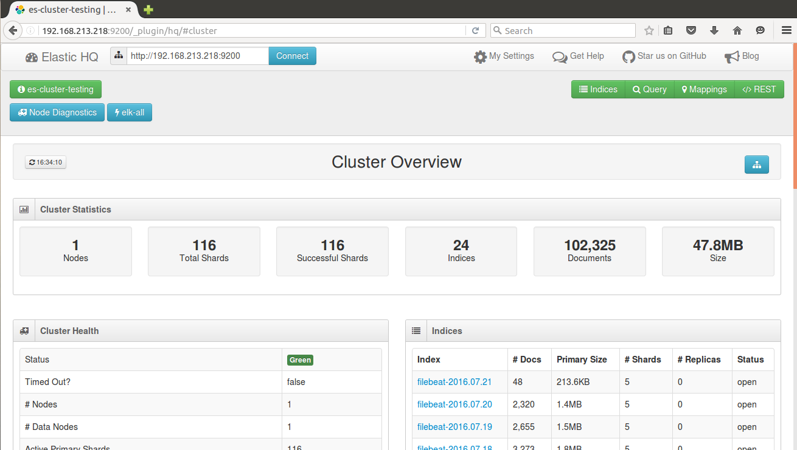

Note: We can talk this out with examples.

---

### Restful APIs over `HTTP` (CURL)

```
curl -X<VERB> '<SCHEMA>://<HOST>/<PATH>?<QUERY_STRING>' -d '<BODY>'
```
<br />
Note:
<div style="font-size:15px" align="left">
`VERB` - The appropriate HTTP method or verb: GET, POST, PUT, HEAD, or DELETE.<br />
`SCHEMA` - Either http or https (if you have an https proxy in front of Elasticsearch.)<br />
`HOST` - The hostname of any node in your Elasticsearch cluster, or localhost for a node on your local machine.<br />
`PORT` - The port running the Elasticsearch HTTP service, which defaults to 9200.<br />
`QUERY_STRING` - Any optional query-string parameters (for example ?pretty will pretty-print the JSON response to make it easier to read.)<br />
`BODY` - A JSON encoded request body (if the request needs one.)<br />
</font>
</div>

---

### What is CRUD?

C - Create
R - Retrieve
U - Update
D - Delete

---

### CRUD operations over Elasticsearch
(hands on)

----

<div align="left">Simple Index Creation with XPUT:</div>
 
```
curl -XPUT 'http://localhost:9200/defcon/'
```

<div align="left">Add data to your created index:</div>

```
curl -XPUT 'http://localhost:9200/defcon/workshop/1' -d '{"user":"ninja"}'
```

<div align="left">To check the Index status:</div>

```
curl -XGET 'http://localhost:9200/defcon/?pretty'
```

----

<div align="left">Automatic doc creation in an index with XPOST:</div>

```
curl -XPOST 'http://localhost:9200/defcon/workshop/' -d '{"user":"ninja"}'
```

<div align="left">Creating a user profile doc:</div>

```
curl -XPUT 'http://localhost:9200/defcon/workshop/9' -d '{"user":"admin", "role":"tester", "job":"engineer"}'
```

<div align="left">Update the document:</div>

```
curl -XPOST 'http://localhost:9200/defcon/workshop/9' -d '{"user":"administrator", "role":"tester", "job":"engineer"}'
```

----

<div align="left">Searching a doc in an index. Create 2 docs:</div>
    
```
curl -XPOST 'http://localhost:9200/defcon/workshop/' -d '{"user":"abcd", "role":"tester", "job":"engineer"}'
```

```
curl -XPOST 'http://localhost:9200/defcon/workshop/' -d '{"user":"abcd", "role":"admin", "job":"engineer"}'
```
    
<div align="left">Then search:</div>

```
curl -XGET 'http://localhost:9200/defcon/_search?q=user:abcd&pretty'
```


<div align="left">Deleting a doc in an index:</div>

```
curl -XDELETE 'http://localhost:9200/defcon/workshop/1'
```


---

## Setting up Logstash

----


----

### Logstash components

Logstash consists of 3 main components

- Input: Passing logs to process them into machine understandable format
- Filters: Set of conditionals to perform specific action on a event 
- Output: Decision maker for processed events/logs

----

### Basic Logstash configuration

```
input {
    stdin {}
    file {}
    ...
}

filter {
    grok {}
    date {}
    geoip {}
    ...
}

output {
   elasticsearch {}
   email {}
   ...
}
```

----

#### Input

> An input plugin enables a specific source of events to be read by Logstash.

- File
- Lumberjack
- S3
- Beats
- Stdin
- Many more.
[https://www.elastic.co/guide/en/logstash/current/input-plugins.html](https://www.elastic.co/guide/en/logstash/current/input-plugins.html)

----

#### Filter

> A filter plugin performs intermediary processing on an event. Filters are often applied conditionally depending on the characteristics of the event.

- CSV
- GeoIP
- Mutate
- Grok
- Many More.
[https://www.elastic.co/guide/en/logstash/current/filter-plugins.html](https://www.elastic.co/guide/en/logstash/current/filter-plugins.html)

----

#### Output

> An output plugin sends event data to a particular destination. Outputs are the final stage in the event pipeline.

- Elasticsearch
- Email
- Stdout
- S3, file
- HTTP
- Many More. 
[https://www.elastic.co/guide/en/logstash/current/output-plugins.html](https://www.elastic.co/guide/en/logstash/current/output-plugins.html)

---

### Installing logstash
(hands on)

----

To install logstash package run the command below

```
sudo dpkg -i /home/ninja/pkgs/logstash.deb
```

----

### Basic logstash pipeline 

<div align="left">A quick test to check your logstash installation:</div>

```
sudo /opt/logstash/bin/logstash -e 'input { stdin {} } output { stdout {} }'
```

---

### A quick primer on Grok filters

----

- The syntax for a grok pattern is `%{SYNTAX:SEMANTIC}`
- `SYNTAX` is the name of the pattern that will match your text.
    - For example: `1337` will be matched by the `NUMBER` pattern, `192.168.123.12` will be matched by the `IP` pattern.
- SEMANTIC is the identifier you give to the piece of text being matched.
E.g. `1337` could be the count and `192.168.123.12` could be a `client` making a request

```
%{NUMBER:count} 
%{IP:client}
```

Note: Grok is based on pre created regex patterns

----

### Example grok

<div align="left">For the following log event:</div>

```
55.3.244.1 GET /index.html 15824 0.043
```

<div align="left">This would be the matching grok:</div>

```
%{IP:client} %{WORD:method} %{URIPATHPARAM:request} %{NUMBER:bytes} %{NUMBER:duration}
```


----

#### Consider the following Apache Log Event

<div align="left">123.249.19.22 - - [01/Feb/2015:14:12:13 +0000] "GET /manager/html HTTP/1.1" 404 448 "-" "Mozilla/3.0 (compatible; Indy Library)"</div>


----

Using a regular expression!!


----

Using Grok filter patterns :)

```
%{IPV4} %{USER:ident} %{USER:auth} \[%{HTTPDATE:timestamp}\] "(?:%{WORD:verb} %{NOTSPACE:request}(?: HTTP/%{NUMBER:httpversion})?)" %{NUMBER:response} (?:%{NUMBER:bytes}|-)
```

----

Things can get even more simpler using an *inbuilt* grok :) :) 

```
%{COMBINEDAPACHELOG}
```

----

### Available Logstash Grok Patterns 
- [https://grokdebug.herokuapp.com/patterns](https://grokdebug.herokuapp.com/patterns)
- [http://grokconstructor.appspot.com/](http://grokconstructor.appspot.com/)
- [https://github.com/logstash-plugins/logstash-patterns-core/blob/master/patterns/grok-patterns](https://github.com/logstash-plugins/logstash-patterns-core/blob/master/patterns/grok-patterns)
- [https://github.com/clay584/logstash_configs](https://github.com/clay584/logstash_configs)

---

### Apache log sample with elasticsearch
(hands on)

----

Let's parse some Apache logs in elasticsearch using logstash

----

Create a logstash config file using the following command:

```
sudo vi /etc/logstash/conf.d/apache.conf
```

----

```
input {
    file {
        path => "/home/ninja/log-samples/access.log"
        start_position => beginning
        ignore_older => 0
    }
}
filter {
    grok {
        match => { "message" => "%{COMBINEDAPACHELOG}"}
    }
    geoip {
        source => "clientip"
    }
}
output {
    elasticsearch {
            hosts => ["localhost:9200"]
            index => "apache-logs"
    }
    #stdout {}
}
```

----

Then provide the config to logstash to start the pipeline

```
sudo /opt/logstash/bin/logstash -f /etc/logstash/conf.d/apache.conf
```

----

Then check the elasticsearch head plugin

```
http://elkhost.defcon:9200/_plugin/head
```

---

## Setting up Kibana

---

> Kibana is an open source analytics and visualization platform designed to work with Elasticsearch. You use Kibana to search, view, and interact with data stored in Elasticsearch indices

---

### Installing Kibana
(hands on)

----

<div align="left">To install the Kibana package, run the command below:</div>

```
sudo dpkg -i /home/ninja/pkgs/kibana.deb
```

----

### Basic Kibana configuration

Just for reference, Here is the kibana config file:

```
sudo vi /opt/kibana/config/kibana.yml
```

Note: Kibana works out of the box support with Elasticsearch

----

<div align="left">Uncomment and change the server address to access the kibana dashboard</div>

```
server.host: "0.0.0.0"
```

<div align="left">Then start the kibana service by running</div>

```
sudo service kibana start
```

----

Kibana Dashboard
```
http://elkhost.defcon:5601/
```

---

### Understanding the Kibana UI

**Index Selection**

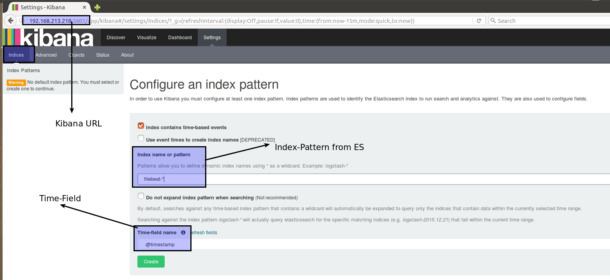

----

**Adding multiple indices**

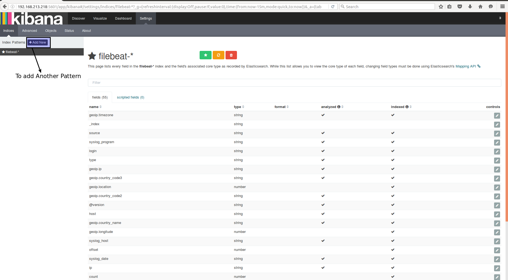

----

**Discovery**

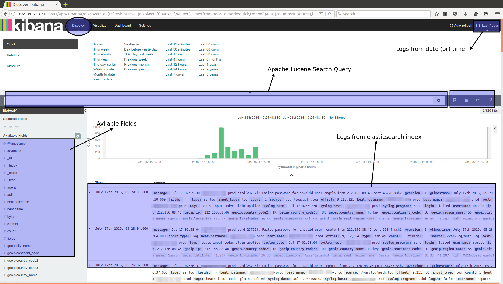

----

**Mapped log in JSON format**

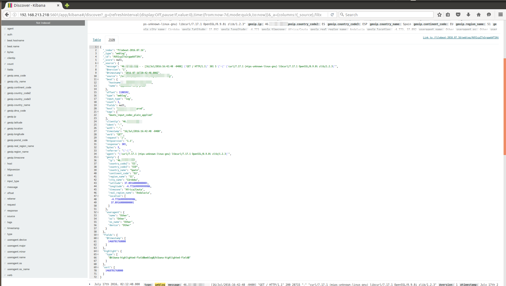

----

**Visualize**

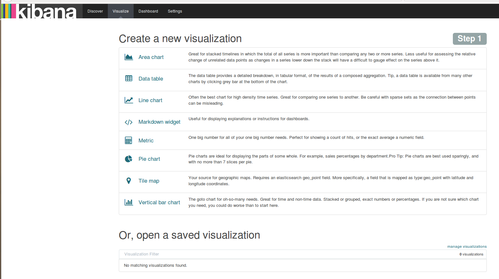

----

**Selecting the search source**


----

**Creating a pie chart**

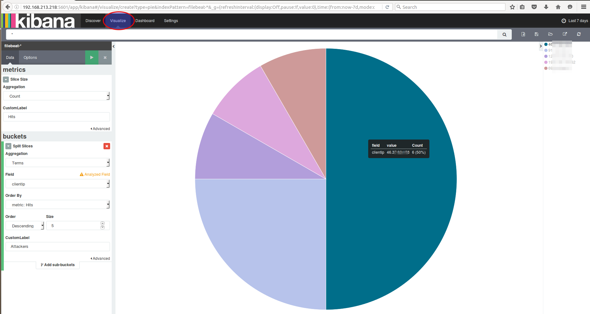

----

**Discover**


----

**Status**

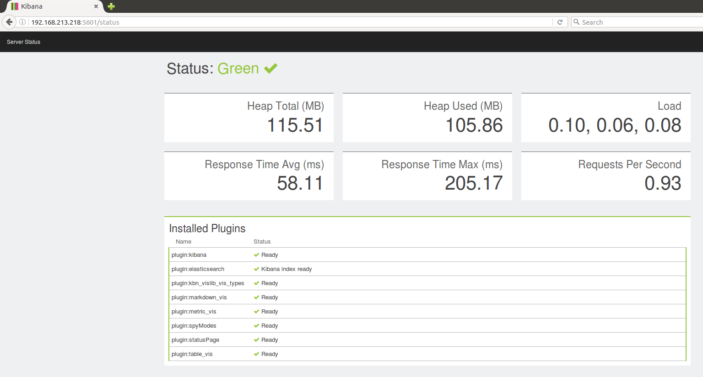

----

**Import/Export**

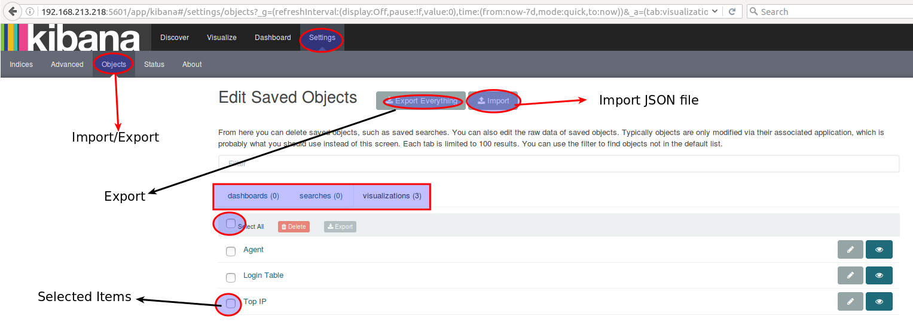

---

Throughout our exercises, did you notice anything missing?

---

### Securing Elasticsearch & Kibana

- By default elasticsearch and kibana doesn't have security
- We are setting up basic authentication using `htpasswd` and `nginx` reverse proxy
- The commercial product called `shield` is available from company. 
- `Search Guard` is an alternative open source project for `shield`.

---

### Basic Authentication setup for Elasticsearch & Kibana
(hands on)

----

Installing `nginx` and `apache2-utils`.

(It's already installed in the virtual machine)

```
sudo apt-get install nginx apache2-utils -y
```

----

To create basic authentication user and password.

```
sudo htpasswd -c /etc/nginx/htpasswd.users elkadmin
```


```
Password : D3fc0nN!nj@
Confirm Password : D3fc0nN!nj@
```

Note:`elkadmin` is the username and password is `D3fc0nN!nj@`

----

<div align="left">Then edit the configuration file of nginx using:</div>

```
sudo vi /etc/nginx/sites-available/default
```

----

```
server {
    listen 80; #for Kibana

    server_name localhost;

    auth_basic "Restricted Access";
    auth_basic_user_file /etc/nginx/htpasswd.users;

    location / {
        proxy_pass http://localhost:5601;
        proxy_http_version 1.1;
        proxy_set_header Upgrade $http_upgrade;
        proxy_set_header Connection 'upgrade';
        proxy_set_header Host $host;
        proxy_cache_bypass $http_upgrade;        
    }
}

server {
    listen 8080; #for Elasticsearch

    server_name localhost;

    auth_basic "Restricted Access";
    auth_basic_user_file /etc/nginx/htpasswd.users;

    location / {
        proxy_pass http://localhost:9200;
        proxy_http_version 1.1;
        proxy_set_header Upgrade $http_upgrade;
        proxy_set_header Connection 'upgrade';
        proxy_set_header Host $host;
        proxy_cache_bypass $http_upgrade;
    }
}
```

----

<div align="left">Restart the nginx service:</div>

```
sudo service nginx restart
```

----

<div align="left">Open the `elasticsearch.yml` and add a host restriction:</div>

```
sudo vi /etc/elasticsearch/elasticsearch.yml
```

<div align="left">Restrict ES access to localhost:</div>

```
network.host: localhost
```

<div align="left">Then restart the service:</div>

```
sudo service elasticsearch restart
```

----

<div align="left">Add the authentication credentials in Kibana:</div>

```
sudo vi /opt/kibana/config/kibana.yml
```

<div align="left">Modify the following entry:</div>

```
server.host: "localhost"
```

<div align="left">Then restart the kibana service:</div>

```
sudo service kibana restart
```

----

<div align="left">Test the changes in Elasticsearch and Kibana by navigating to:</div>

```
http://elkhost.defcon:80
```

```
http://elkhost.defcon:8080
```

---

### [Backing up Elasticsearch using Curator](03-backup-es.md)

